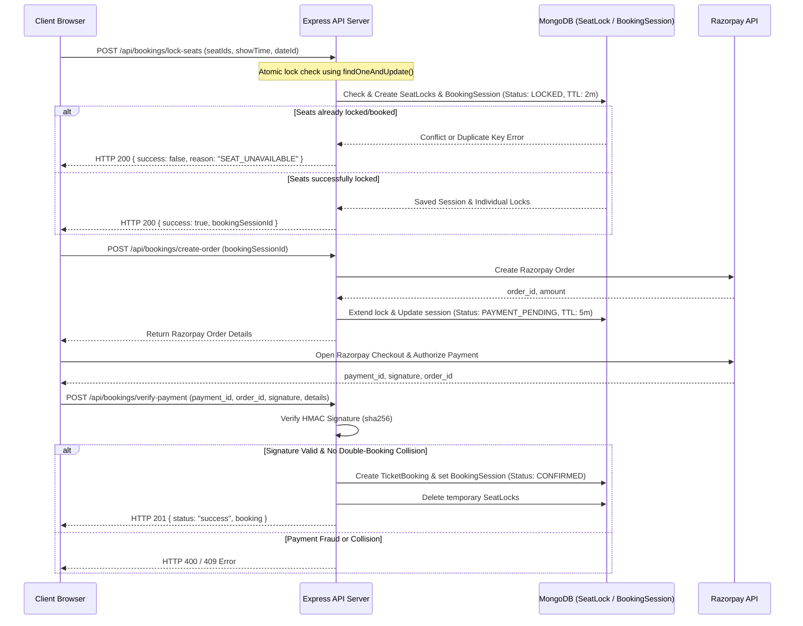

# Movie Mukkalu 🎬

[](#)
[](https://opensource.org/licenses/MIT)
[](https://nodejs.org)
[](https://react.dev)
[](https://www.mongodb.com)

**Movie Mukkalu** is a high-performance, real-time movie ticket booking platform designed for high-concurrency environments. Built with a robust **React 19** frontend and a secure **Express/Node.js** backend, it solves the classic double-booking problem using **atomic pessimistic seat locking** paired with automatic database-level TTL (Time-To-Live) index releases. Payments are integrated with **Razorpay** with secure, cryptographic signature verification.

---

## 🚀 Key Features

*   **Real-Time Seat Mapping:** Instant visualization of available, booked, and temporarily locked seats using 4-second short polling.
*   **Atomic Pessimistic Seat Locking:** Uses MongoDB unique compound indexes and atomic operations to guarantee that a seat can only be selected by one session at a time.
*   **Automated Lock Release (TTL Indexes):** Automatically frees seats if checkout is abandoned (2-minute initial lock, extended to 5 minutes during the payment phase).
*   **Secure Payment Flow:** Fully integrated with **Razorpay Checkout SDK** and verified server-side with HMAC-SHA256 signature verification.
*   **Stateless Sessions:** Leverages anonymous client-generated UUID sessions to allow immediate booking without requiring pre-registration.
*   **Email Confirmations:** Sends high-fidelity transaction receipt emails to the customer and instant notifications to the administration panel.

---

## 🏗️ System Architecture & Locking Mechanism

To prevent race conditions during high-demand shows, **Movie Mukkalu** uses a multi-phase pessimistic locking protocol:



---

## 🛠️ Technology Stack

### Frontend
*   **React 19 & React Router 7:** Modern SPA routing and reactive UI.
*   **Vite:** Ultra-fast bundler and development environment.
*   **Framer Motion:** Custom page-transition and seat-selection animations.
*   **Tailwind CSS:** Fully responsive mobile-first utility styling.
*   **Axios:** HTTP client featuring global session interceptors.

### Backend & Database
*   **Node.js & Express:** Clean middleware-driven REST API.
*   **MongoDB & Mongoose:** Document database with custom indices.
*   **Razorpay SDK:** Payment gateway order creation.
*   **Nodemailer:** Automated SMTP transactional email service.

---

## 🗄️ Database Schemas & Indexing

### 1. `SeatLock` (Temporary Pessimistic Lock)
Ensures a seat cannot be locked by multiple sessions simultaneously.
*   **Unique Index:** `{ dateId: 1, showTime: 1, seatId: 1 }` (Enforces absolute uniqueness).
*   **TTL Index:** `{ expiresAt: 1 }` with `expireAfterSeconds: 0`. MongoDB automatically deletes the lock document once the system time passes `expiresAt`.

### 2. `BookingSession` (Checkout Process State)
Manages the state machine (`LOCKED` -> `PAYMENT_PENDING` -> `CONFIRMED` / `FAILED`) of a user's transaction.
*   **TTL Index:** `{ expiresAt: 1 }` with `expireAfterSeconds: 0`.

### 3. `TicketBooking` (Permanent Confirmation)
Stores completed bookings with payment metadata.
*   **Unique Sparse Indexes:** `{ paymentId: 1 }` and `{ orderId: 1 }` to guarantee payment idempotency.

---

## 📡 API Documentation

All API requests expect the header `x-session-id: <UUID>` for session tracking.

### Booking Endpoints

| Method | Endpoint | Description | Request Body / Query | Success Response |
| :--- | :--- | :--- | :--- | :--- |
| **GET** | `/api/bookings` | Fetch all unavailable (booked or active locked) seats. | **Query:** `?dateId=XX&showTime=YY` | `["A1", "A2", "B3"]` (Status 200) |
| **POST** | `/api/bookings/lock-seats` | Lock a set of seats for 2 minutes. | `{"dateId": "1", "showTime": "10-00-AM", "seatIds": ["A1"], "movieName": "Gita Govindham"}` | `{"success": true, "bookingSessionId": "ID"}` (Status 200) |
| **POST** | `/api/bookings/create-order` | Generate Razorpay order & extend locks to 5 minutes. | `{"bookingSessionId": "SESSION_ID"}` | Razorpay Order Object (Status 200) |
| **POST** | `/api/bookings/verify-payment` | Verify HMAC signature and save the booking. | `{"razorpay_order_id": "...", "razorpay_payment_id": "...", "razorpay_signature": "...", "bookingDetails": {...}}` | `{"status": "success", "booking": {...}}` (Status 210) |
| **POST** | `/api/bookings/cancel-order` | Manually cancel order and release seat locks immediately. | `{"bookingSessionId": "SESSION_ID"}` | `{"message": "Seats released"}` (Status 200) |
| **GET** | `/api/bookings/rukku-bookings` | Admin: Retrieve historical records (Sorted newest first). | *None* | `[BookingObjects]` (Status 200) |
| **PUT** | `/api/bookings/:id/visited` | Admin: Toggle checked-in/visited status. | `{"visited": true}` | Updated Booking Object (Status 200) |

### Stall Endpoints

| Method | Endpoint | Description | Request Body | Success Response |
| :--- | :--- | :--- | :--- | :--- |
| **GET** | `/api/stalls` | Retrieve all registered food stalls. | *None* | `[StallObjects]` (Status 200) |
| **POST** | `/api/stalls` | Register a new food stall. | `{"stallName": "...", "ownerName": "...", "mobileNumber": "...", "email": "..."}` | Registered Stall Object (Status 201) |

---

## ⚙️ Configuration & Environment Variables

Create a `.env` file in the respective folders using the templates below:

### Backend (`backEnd/.env`)
```env
PORT=5000
MONGODB_URI=mongodb+srv://<user>:<password>@cluster.mongodb.net/movie_mukkalu
RAZORPAY_KEY_ID=rzp_test_yourKeyId
RAZORPAY_KEY_SECRET=yourKeySecret
EMAIL_USER=your-email@gmail.com
EMAIL_PASS=your-app-specific-password
```

### Frontend (`frontEnd/.env`)
```env
VITE_API_BASE_URL=http://localhost:5000/api
VITE_RAZORPAY_KEY_ID=rzp_test_yourKeyId
```

---

## 🛠️ Local Development Setup

### Prerequisites
*   Node.js (v18.x or higher)
*   MongoDB Instance (Local or Atlas)
*   Razorpay Merchant Account (Test Mode)

### Step-by-Step Installation

1.  **Clone the Repository:**
    ```bash
    git clone <repository-url>
    cd "Movie mukkalu"
    ```

2.  **Set Up Backend:**
    ```bash
    cd backEnd
    npm install
    # Configure your .env file
    npm run dev
    ```
    *The server will start running on `http://localhost:5000`.*

3.  **Set Up Frontend:**
    ```bash
    cd ../frontEnd
    npm install
    # Configure your .env file
    npm run dev
    ```
    *The client will start running on `http://localhost:5173`.*

---

## 🚢 Production Deployment

### Backend (Railway, Render, or Heroku)
1.  Set the `NODE_ENV` environment variable to `production`.
2.  Provide all backend `.env` variables in your provider's dashboard settings.
3.  The server uses a dynamic port binder (`process.env.PORT || 5000`).

### Frontend (Vercel, Netlify, or Amplify)
1.  Configure the build command as `npm run build` and the output directory as `dist`.
2.  Provide `VITE_API_BASE_URL` pointing to your deployed backend API domain.
3.  Ensure CORS settings on your backend authorize requests originating from your frontend domain.

---

## 📄 License

Distributed under the MIT License. See [LICENSE](LICENSE) for more details.

---
Created with ❤️ by **Bhanu Prakash Alahari**
